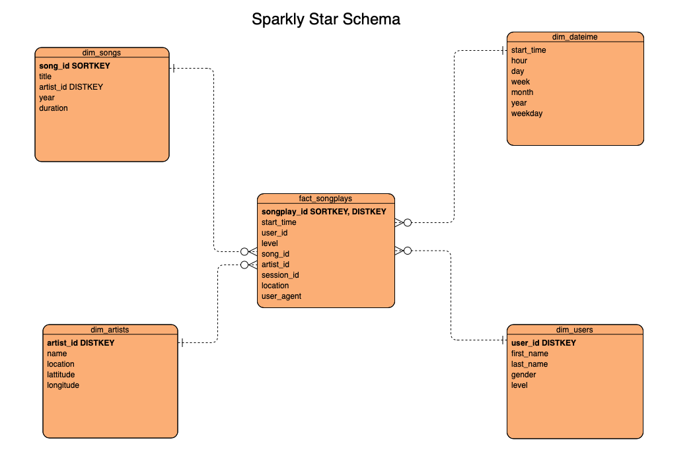

# Data Modeling for Sparkify with PYSPARK and AWS S3 PARQUET
## Background 
### Introduction
A music streaming startup, Sparkify, has grown their user base and song database and want to move their processes and data onto the cloud. Their data resides in S3, in a directory of JSON logs on user activity on the app, as well as a directory with JSON metadata on the songs in their app.

The project requires to build an ETL pipeline that extracts their data from Udacity `S3 bucket`, stages them with `PySpark`, and transforms data into a set of dimensional tables into `AWS S3 PAQUET` for their analytics team to continue finding insights in what songs their users are listening to.

In order to carry out the project data needs to be loaded from S3 to staging tables on `PYSPARK AWS EMR CLUSTER` and execute statements that create the analytics tables from these star schema staging tables.

`Note: Background is based on Udacity Data Engineering Nano degree Program`

## Prerequisites for running the program
The project is built in python 3.x , and PySPARK 2.4.5, and deployed in EMR cluster with 5 m5.xlarge node clusters.

## File Info
### Data Files in S3 bucket:
#### Song_data
The first dataset is a subset of real data from the Million Song Dataset. Each file is in JSON format and contains metadata about a song and the artist of that song. The files are partitioned by the first three letters of each song's track ID. For example, here are filepaths to two files in this dataset.

```json
song_data/A/B/C/TRABCEI128F424C983.json
song_data/A/A/B/TRAABJL12903CDCF1A.json
```

And below is an example of what a single song file, TRAABJL12903CDCF1A.json, looks like.

```
{"num_songs": 1, "artist_id": "ARJIE2Y1187B994AB7", "artist_latitude": null, "artist_longitude": null, "artist_location": "", "artist_name": "Line Renaud", "song_id": "SOUPIRU12A6D4FA1E1", "title": "Der Kleine Dompfaff", "duration": 152.92036, "year": 0}
```

#### Log_data
The second dataset consists of log files in JSON format generated by this event simulator based on the songs in the dataset above. These simulate activity logs from a music streaming app based on specified configurations.

The log files in the dataset you'll be working with are partitioned by year and month. For example, here are filepaths to two files in this dataset.

```
log_data/2018/11/2018-11-12-events.json
log_data/2018/11/2018-11-13-events.json
```
And below is an example of what the data in a log file, 2018-11-12-events.json, looks like.

```	
|    | artist   | auth      | firstName   | gender   |   itemInSession | lastName   |   length | level   | location                          | method   | page     |   registration |   sessionId | song         |   status |            ts | userAgent                                                                                                                  |   userId |
|----|----------|-----------|-------------|----------|-----------------|------------|----------|---------|-----------------------------------|----------|----------|----------------|-------------|--------------|----------|---------------|----------------------------------------------------------------------------------------------------------------------------|----------|
|  0 |          | Logged In | Walter      | M        |               0 | Frye       |  nan     | free    | San Francisco-Oakland-Hayward, CA | GET      | Home     |    1.54092e+12 |          38 |              |      200 | 1541105830796 | "Mozilla/5.0 (Macintosh; Intel Mac OS X 10_9_4) AppleWebKit/537.36 (KHTML, like Gecko) Chrome/36.0.1985.143 Safari/537.36" |       39 |
|  1 |          | Logged In | Kaylee      | F        |               0 | Summers    |  nan     | free    | Phoenix-Mesa-Scottsdale, AZ       | GET      | Home     |    1.54034e+12 |         139 |              |      200 | 1541106106796 | "Mozilla/5.0 (Windows NT 6.1; WOW64) AppleWebKit/537.36 (KHTML, like Gecko) Chrome/35.0.1916.153 Safari/537.36"            |        8 |
|  2 | Des'ree  | Logged In | Kaylee      | F        |               1 | Summers    |  246.308 | free    | Phoenix-Mesa-Scottsdale, AZ       | PUT      | NextSong |    1.54034e+12 |         139 | You Gotta Be |      200 | 1541106106796 | "Mozilla/5.0 (Windows NT 6.1; WOW64) AppleWebKit/537.36 (KHTML, like Gecko) Chrome/35.0.1916.153 Safari/537.36"            |        8 |
|  3 |          | Logged In | Kaylee      | F        |               2 | Summers    |  nan     | free    | Phoenix-Mesa-Scottsdale, AZ       | GET      | Upgrade  |    1.54034e+12 |         139 |              |      200 | 1541106132796 | "Mozilla/5.0 (Windows NT 6.1; WOW64) AppleWebKit/537.36 (KHTML, like Gecko) Chrome/35.0.1916.153 Safari/537.36"            |        8 |
|  4 | Mr Oizo  | Logged In | Kaylee      | F        |               3 | Summers    |  144.039 | free    | Phoenix-Mesa-Scottsdale, AZ       | PUT      | NextSong |    1.54034e+12 |         139 | Flat 55      |      200 | 1541106352796 | "Mozilla/5.0 (Windows NT 6.1; WOW64) AppleWebKit/537.36 (KHTML, like Gecko) Chrome/35.0.1916.153 Safari/537.36"            |        8 |

```
`Information taken from Udacity Nano degree Programme`
### AWS Config File:
This file consists of all the configuration required to connect to aws and `S3` buckets.

### Python Scripts:
1. starSchema.py: All the pyspark dataframe functions for transforming the dataframe of both song and log to fact and dimensional tables.

2. dataProcessing.py: The script will clean the JSON data from the S3 bucket for both songs and log file. It is also used to write the final star schema dataframes into S3 parquets.

3. Etl.py: The script used for running the following task using database.py:
    1. Load data from S3 to `PYSPARK` for extracting.
    2. Using `PYSPARK` to clean the data from song and log
    3. Transforms song and event data into `Sparkify Star Schema` (seen below)
    4. Write the star schema to `S3` as `PARQUET`.
    
## Execution of the project
1. To launch in EMR configure the cluster with the following JSON script. This will make sure the cluster is running in python 3.x rather 2.x.
#### EMR  Setup instruction for Python 3 [ Instruction as per AWS ] https://aws.amazon.com/premiumsupport/knowledge-center/emr-pyspark-python-3x/
    
Resolution
On a running cluster

Run the following command to change the default Python environment:
sudo sed -i -e '$a\export PYSPARK_PYTHON=/usr/bin/python3' /etc/spark/conf/spark-env.sh
Run the pyspark command to confirm that PySpark is using the correct version of Python:
[hadoop@ip-X-X-X-X conf]$ pyspark

On a new cluster

Add a configuration object similar to the following when you launch a cluster using Amazon EMR release version 4.6.0 or later:

` json
[
  {
     "Classification": "spark-env",
     "Configurations": [
       {
         "Classification": "export",
         "Properties": {
            "PYSPARK_PYTHON": "/usr/bin/python3"
          }
       }
    ]
  }
]
`
2. pip install configparser in the EMR master node. 
3. Execute in `terminal:` `python etl.py`. This will extract, transform, and finally load the data in the database.

## ERD for sparkify


## ETL process for sparkify

